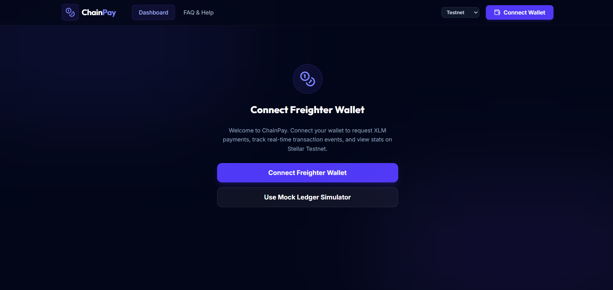
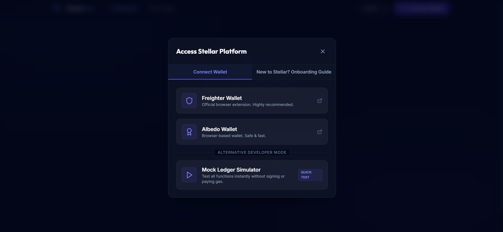
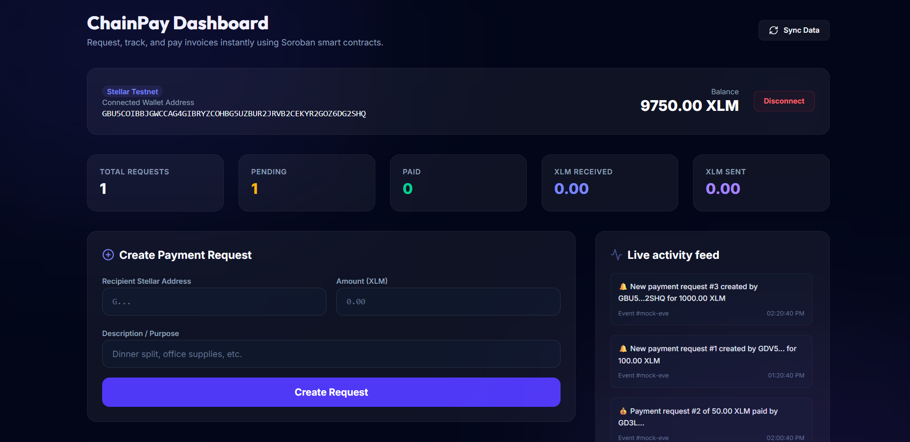
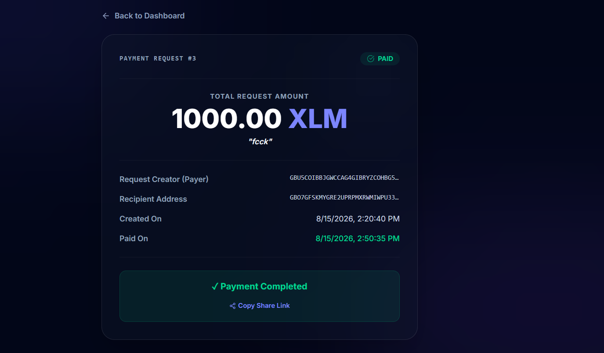
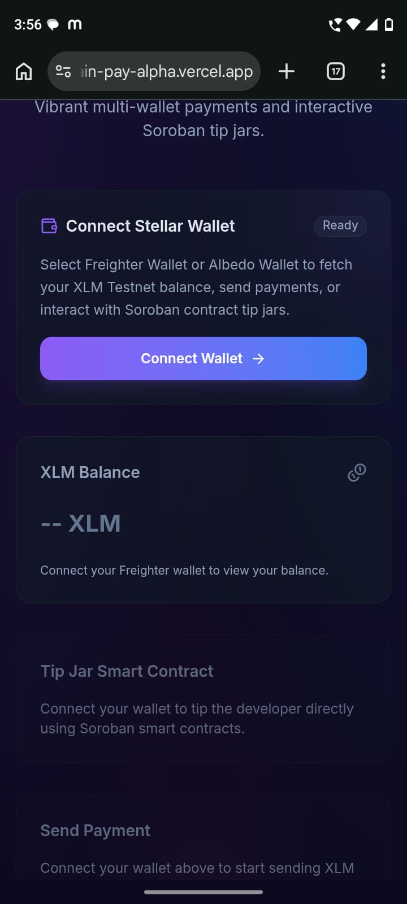

# ChainPay — Smart Payment Request & Tracking dApp

ChainPay is a realistic, decentralized payment request, tracking, and settlement application built on the **Stellar Testnet** using **Soroban Smart Contracts** and integrated with **Freighter Wallet**.

---

## ⚠️ Problem

Manually coordinating and tracking peer-to-peer payments on-chain is tedious and error-prone:
- Address typing mistakes lead to lost funds.
- Confirming that a specific counterparty has completed a transaction requires manually scanning explorer logs.
- Requesting splits (e.g., dinner or bills) is disconnected from the actual on-chain transaction execution.

## 🛠️ Solution

ChainPay resolves these issues by introducing an on-chain **Smart Payment Request system**:
1. **Invoice Storage**: Receptive payments are registered directly inside Soroban contract persistent ledger storage with unique request IDs.
2. **Atomic Settlement**: Clicking "Pay Request" initiates a secure contract transaction that transfers the exact requested amount from the payer to the recipient and transitions the invoice status to `PAID` atomically.
3. **Real-time Event Tracking**: Real-time event emitters notify the frontend instantly of invoice creation, cancellation, and payment logs.

---
## 🌐 Live Demo

**Live Application:**

https://chain-pay-alpha.vercel.app/
---

## 📹 Demo Video

Watch the complete project demonstration:

https://youtu.be/LipH_gYG1D4
---

## 📂 GitHub Repository

https://github.com/dishabhuniya/chain-payy

## 🚀 Features

- **Freighter Wallet Integration**: Connect your wallet, view real-time XLM balances, and approve payments.
- **Smart Payment Requests**: Generate unique payment invoices on-chain with customized descriptions.
- **Direct Atomic Transfers**: Direct token transfers from payer to recipient are handled inside the smart contract context.
- **Real-Time Activity Feed**: Streams and polls live Soroban event logs (`req_crea`, `req_paid`, `req_canc`) from the blockchain.
- **Invoice Shareability**: Share specific invoices via `/request/<id>` URLs, allowing counterparties to pay immediately.
- **Payment Statistics**: View statistics for total requests, paid invoices, pending list, and total XLM received or sent.
- **Transaction Tracker**: Watch status progress step-by-step: *Preparing...* ➔ *Waiting for wallet approval...* ➔ *Submitted...* ➔ *Confirming...* ➔ *Success ✓*.
- **Mobile Responsive Layout**: Optimized viewports tested for 320px, 375px, 768px, and Desktop.

---

## 📐 Architecture

```text
       React Frontend
            ↓
     Freighter Wallet (Sign)
            ↓
      Stellar Testnet
            ↓
  Soroban Payment Contract (CDDXP...)
            ↓
   Ledger Event Emitters (req_crea, req_paid, req_canc)
            ↓
  Real-time Activity Feed & UI Pollers
```

---

## ⛓️ Smart Contract Details

- **Contract ID on Testnet**: `CDDXP4MWAHLV6TEYVG6I62CBP2INMSJ32Z33BKCBFTOEVSX3BB26WKUB`
- **Functions**:
  - `create_request(creator: Address, recipient: Address, token: Address, amount: i128, description: String) -> u64`: Generates sequencial request ID and stores invoice data.
  - `pay_request(payer: Address, request_id: u64)`: Transfers tokens atomically and updates status to `Paid`.
  - `cancel_request(caller: Address, request_id: u64)`: Cancels pending request if caller is the creator.
  - `get_request(request_id: u64) -> Option<PaymentRequest>`: Fetches invoice details.
- **Storage Strategy**:
  - `Instance`: Tracks the global sequential request count counter (`DataKey::RequestCount`).
  - `Persistent`: Stores detailed `PaymentRequest` structures mapped to IDs.
- **Events Emitted**:
  - `req_crea`: Creator, recipient, and amount.
  - `req_paid`: Payer, recipient, and amount.
  - `req_canc`: Caller address.
- **Security Validations**:
  - Amount must be positive (> 0).
  - Transition constraints: Only `PENDING` -> `PAID` or `PENDING` -> `CANCELLED` allowed.
  - Double payments or cancellations of paid requests are blocked.
  - Payer and Creator auth checks (`require_auth()`).

---
## 📸 Screenshots

### Home Dashboard



### Wallet Connection



### Connected Wallet & Balance



### Transaction Success



### Mobile Responsive View



---

## 🔧 Setup & Local Development

### Prerequisites
- [Node.js](https://nodejs.org/) (v18+)
- [Rust & Cargo](https://www.rust-lang.org/)
- [Stellar CLI](https://developers.stellar.org/docs/build/smart-contracts/getting-started/setup#install-the-stellar-cli) (v26.1.0+)

### 1. Install Dependencies
```bash
npm install
```

### 2. Configure Environment Variables
Copy `.env.example` to `.env` and adjust the variables:
```bash
cp .env.example .env
```

Ensure `.env` contains:
```env
VITE_STELLAR_NETWORK="testnet"
VITE_STELLAR_RPC_URL="https://soroban-testnet.stellar.org"
VITE_PAYMENT_CONTRACT_ID="CDDXP4MWAHLV6TEYVG6I62CBP2INMSJ32Z33BKCBFTOEVSX3BB26WKUB"
VITE_REGISTRY_CONTRACT_ID=""
```

### 3. Run Dev Server
```bash
npm run dev
```
Open `http://localhost:5173` in your browser.

---

## 🧪 Running Tests

### Run Smart Contract Tests
Run Rust tests from the workspace root or inside `contracts/chainpay-contract`:
```bash
cargo test
```

### Run Frontend Tests
Run Vitest component tests:
```bash
npm run test
```

---

Contract Verification Details

Contract ID:
CDDXP4MWAHLV6TEYVG6I62CBP2INMSJ32Z33BKCBFTOEVSX3BB26WKUB
Contract Explorer (Stellar Testnet):
https://lab.stellar.org/smart-contracts/contract-explorer?$=network$id=testnet&label=Testnet&horizonUrl=https:////horizon-testnet.stellar.org&rpcUrl=https:////soroban-testnet.stellar.org&passphrase=Test%20SDF%20Network%20/;%20September%202015;&smartContracts$explorer$contractId=CDDXP4MWAHLV6TEYVG6I62CBP2INMSJ32Z33BKCBFTOEVSX3BB26WKUB;;

Please use the above Contract Explorer link to verify the deployed Soroban smart contract on the Stellar Testnet.

## 🚀 Smart Contract Deployment

To redeploy the contract to Stellar Testnet:

1. **Configure identity keys**:
   ```bash
   stellar keys generate --global deployer --network testnet
   ```
2. **Fund the account**:
   ```bash
   curl "https://friendbot.stellar.org?addr=$(stellar keys address deployer)"
   ```
3. **Build the WASM binary**:
   ```bash
   stellar contract build
   ```
4. **Deploy contract**:
   ```bash
   stellar contract deploy \
     --wasm target/wasm32v1-none/release/chainpay_contract.wasm \
     --source deployer \
     --network testnet
   ```
   Paste the generated contract ID into your `.env` as `VITE_PAYMENT_CONTRACT_ID`.
